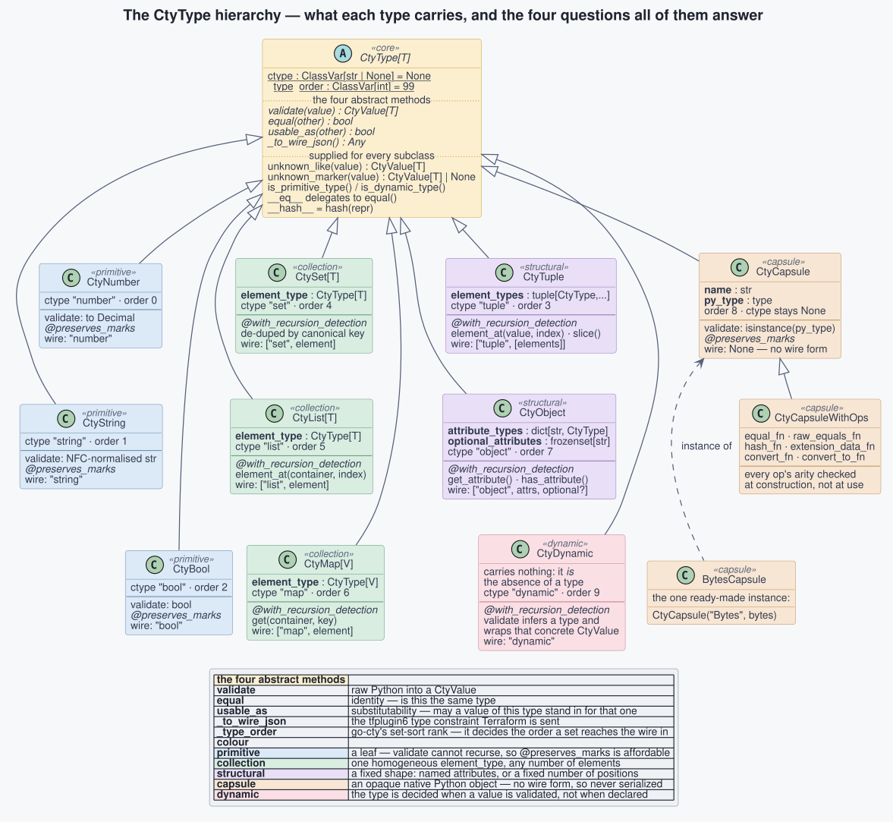
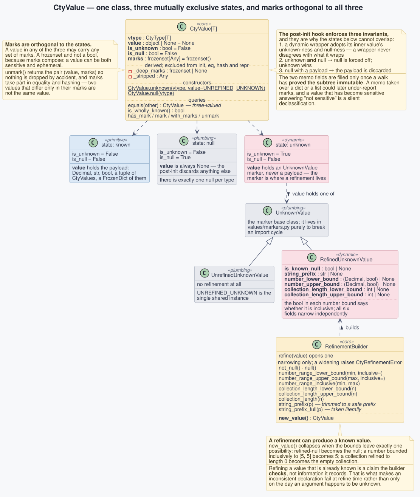
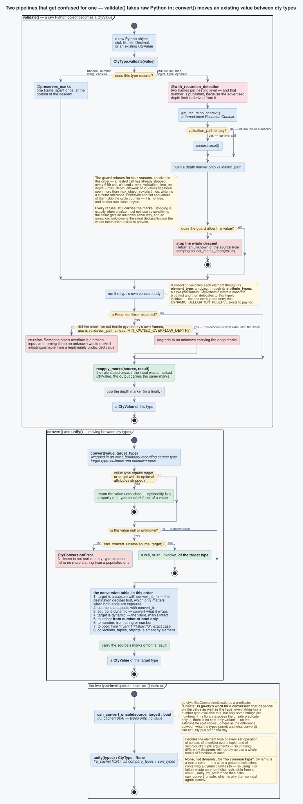
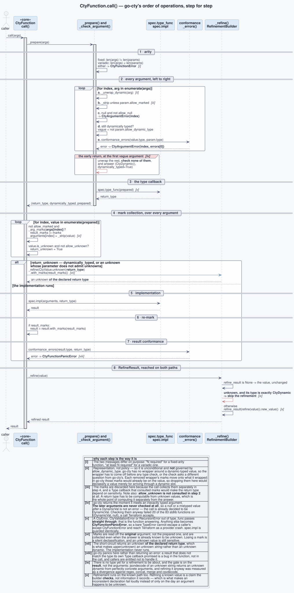
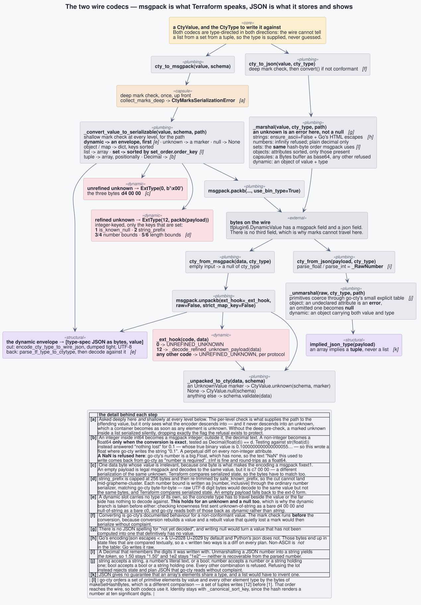
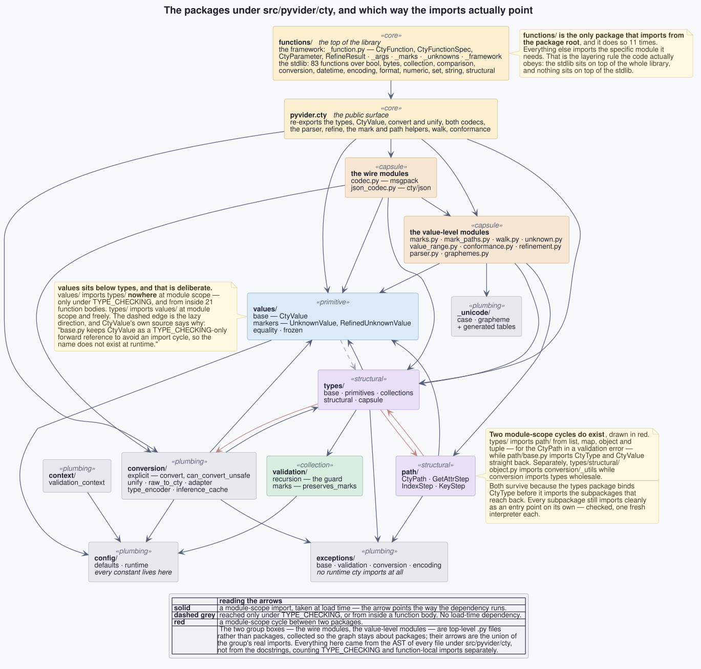
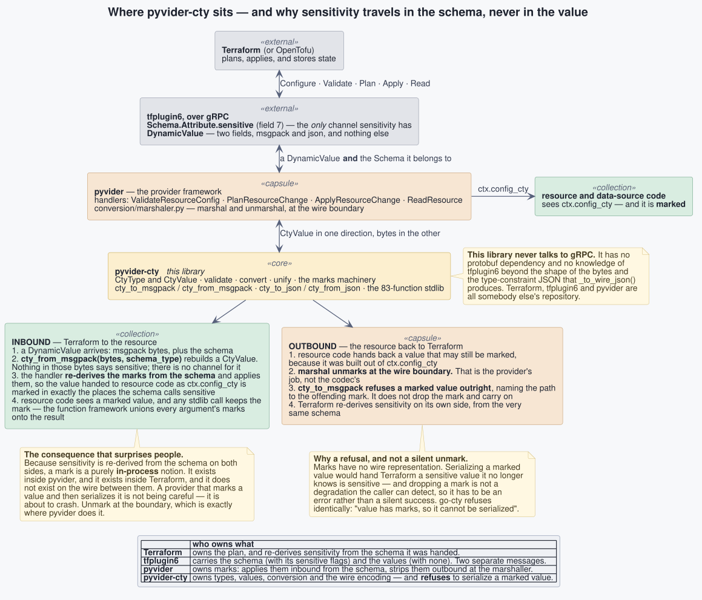
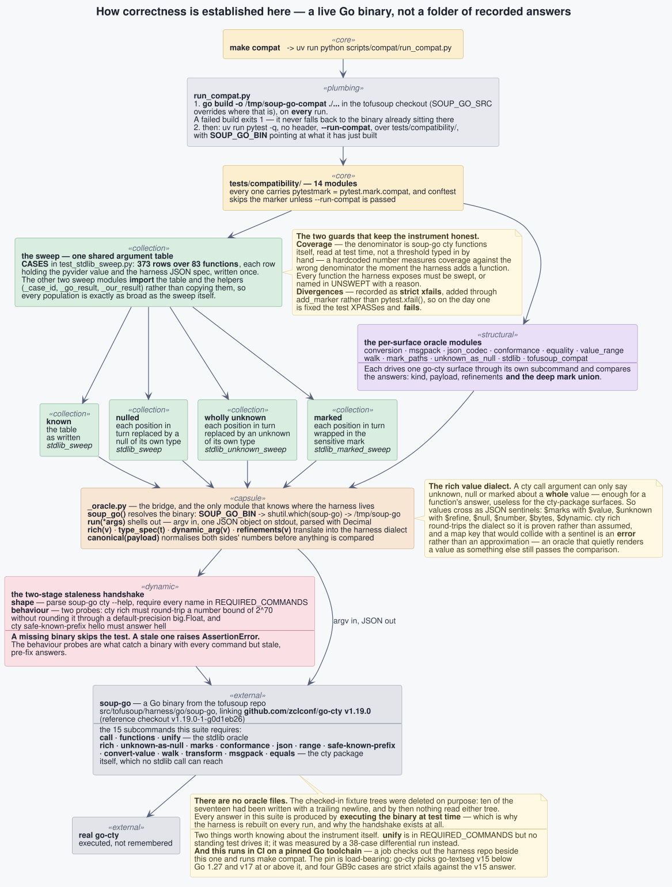

# Architecture

These eight diagrams are the map of pyvider-cty. Every class name, method name,
field and arrow on them was taken from the source under `src/pyvider/cty/` and
the tests under `tests/`, not from prose written about it — including the
module map, whose edges were derived from the AST of every file in the package
rather than from anybody's recollection of which way the imports point.

The sources are PlantUML, one file per diagram, beside the rendered SVGs.
`make diagrams` re-renders them all; `make diagrams-check` fails if a committed
SVG has drifted from its source, so the pictures cannot quietly stop being true
while the code moves on. Add `PNG=1` to also get PNGs, which is what you want
when you are reviewing a change to one of them.

Each SVG below is a link to itself: the diagrams are dense, and clicking through
gives you the full-size, infinitely zoomable original rather than the page-width
copy.

---

## 1. The type system

A cty type is not a Python type. It is a *description* that can be sent over a
wire, compared for identity, checked for substitutability, and asked to turn a
raw Python object into a value. Those four jobs are exactly the four abstract
methods on `CtyType`, and the reason the class is worth looking at closely is
that they are four *different* questions which are easy to conflate. `equal`
asks whether two types are the same. `usable_as` asks whether a value of one may
stand in for the other — a weaker and quite separate relation. `_to_wire_json`
produces the type constraint Terraform is handed, which is why a capsule, having
no wire form, answers `None` and can never be serialized. And `validate` is the
only door through which raw Python becomes a `CtyValue`.

The diagram also shows what each concrete type actually *carries*, because that
is the whole taxonomy: the collections carry one `element_type`, the structural
types carry a fixed shape (`attribute_types` plus `optional_attributes`, or a
positional `element_types` tuple), the capsule carries a native Python class,
and `CtyDynamic` carries nothing at all — it is the absence of a decided type,
resolved when a value is validated against it. Watch the decorator on each
`validate`: leaf types get `@preserves_marks`, and the recursing types get
`@with_recursion_detection` instead, because stacking both would cost a third
stack frame per nesting level and cut the library's advertised maximum depth by
a third.

## 2. The value model

Everything else in the library operates on `CtyValue`, so the distinctions it
makes are the distinctions the whole system can express. There are three states
and they are mutually exclusive: **known**, where `value` holds the payload;
**null**, where `value` is always `None`; and **unknown**, where `value` holds an
`UnknownValue` *marker* rather than any payload at all. What keeps them from
overlapping is not convention but the post-init hook, which forces null off when
a value is unknown, discards a payload attached to a null, and makes a dynamic
wrapper adopt the unknown-ness and null-ness of whatever it wraps.

Marks are the fourth axis, orthogonal to all three: a value in any state may
carry any set of them, and they are a `frozenset` rather than a boolean because
marks compose — a value can be both sensitive and ephemeral. The refinement
machinery hangs off the unknown state. `RefinedUnknownValue` carries all six of
go-cty's keys, and `RefinementBuilder` is the part that makes them trustworthy:
it only ever narrows, it raises on a contradiction, and — the behaviour that
surprises everyone on first reading — it can collapse an unknown into a *known*
value when the bounds leave exactly one possibility.

## 3. Validation, and conversion

Two pipelines that get mistaken for each other. `validate()` is the boundary
between raw Python and cty: it takes a dict or a list or a `Decimal` and returns
a `CtyValue`. `convert()` never sees raw Python at all — it moves an existing
value from one cty type to another. Confusing them is how a library ends up with
`convert(true, number)` returning 1, because a Python `bool` is an `int` and
`validate` will happily accept it, where go-cty has no bool-to-number conversion
whatsoever.

The interesting half of the validate path is the guard. `@with_recursion_detection`
maintains a thread-local `RecursionContext` and stops the descent for any of four
reasons — a nested call already stopped, a validation timeout, excessive depth,
or an object id seen too many times, which is a circular reference. The rule
worth internalising is what happens on a stop: the caller gets an unknown of the
source type **carrying the value's deep marks**, because stopping is exactly the
moment when a value must not quietly lose its sensitivity. The same reasoning
governs the `RecursionError` handler, which re-raises unless it can establish
both that the stack ran out inside this library's own frames *and* that this
descent is what consumed it — so a caller already some 990 frames deep validating a
two-level value gets the exception surfaced instead of a perfectly valid input
silently degrading to unknown.

On the conversion side, note that there is exactly one type-level predicate here:
`can_convert_unsafe`. "Unsafe" is go-cty's word for a conversion that depends on
the value as well as the type — every string has a number type available to it,
but only some strings are numbers — so the safe/unsafe distinction shows up in
this library as the gap between what the types permit and what `convert()` can
actually pull off on the day. `unify()` answers `None` rather than `dynamic` when
there is no common type, because `dynamic` is a real answer and using it for
failure too made an error indistinguishable from a result.

## 4. The function call

This is the most load-bearing diagram in the set, and the one to read if you read
only one. `CtyFunction.call()` reproduces go-cty's order of operations exactly,
and almost every argument-handling divergence this project has found against
go-cty came from getting one step of it in the wrong place.

Three steps deserve calling out. First, the **early return at the first inexactly
typed argument**: go-cty stops checking the moment it meets one, so a null or a
mistyped value *after* a `DynamicVal` is not an error — the whole call is already
decided to be `DynamicVal`. Checking them anyway failed 20 of the 83 stdlib
functions on a call Terraform accepts. Second, the **unknown short-circuit
returns an unknown of the declared return type**, not an unknown dynamic, which
is what makes `upper(unknown)` an unknown *string*; the implementation never
runs. Third, **`RefineResult` is applied on both paths**, and skipped only when
the result type is exactly dynamic — the gate is on the result, not on the
arguments, because `jsondecode` of an unknown string produces an unknown dynamic
from perfectly concrete arguments.

Marks thread through all of it: they are read off the *original* argument rather
than the prepared one, and they are collected even when the answer is already
known to be unknown, because an unknown value is still sensitive.

## 5. The wire codecs

msgpack is what Terraform actually speaks; JSON is what it stores and shows. Both
codecs are type-directed in both directions, because the wire cannot tell a list
from a set from a tuple — all three are arrays — so the type is supplied rather
than guessed.

Most of this diagram is about the places where two implementations can agree on
the *value* and disagree on the *bytes*, which matters because Terraform compares
serialized state and a byte difference is a diff on every plan. An unrefined
unknown is written as `ExtType(0, b"\x00")` — one data byte whose value is
irrelevant, because one byte is what makes it a msgpack `fixext1` rather than the
equally-valid-and-different `c7 00 00`. A refined unknown is `ExtType(12, ...)`
wrapping an integer-keyed map of only the refinements that are set. A non-integer
number becomes a float64 only when the conversion is *exactly* reversible, and
the decimal text otherwise. Sets are sorted by the same canonical key in both
codecs so they cannot drift apart. And JSON strings get Go's four HTML escapes,
which Python's `json` does not apply.

The other thing to take from this diagram is what the wire *cannot* carry: an
unknown has no JSON spelling and is an error rather than a null, and marks have
no representation in either codec, which leads directly to the next diagram.

## 6. The module map

Derived from imports, not from intent. The arrows point the way the dependency
actually runs at load time, with TYPE_CHECKING-only and function-local imports
counted separately and drawn dashed.

The rule the code genuinely obeys is that **`values/` sits below `types/`**:
`values/` imports `types/` at module scope nowhere at all — only under
TYPE_CHECKING and from inside twenty-one function bodies — while `types/` imports
`values/` freely. That is a deliberate arrangement, and `CtyValue`'s own source
says so. The other rule is at the top: `functions/` is the only package that
imports from the package root, eleven times, which is what makes the stdlib the
layer everything else sits under and nothing sits on.

Two module-scope cycles do exist, and the diagram draws them in red rather than
tidying them away: `types/` ↔ `path/`, because a validation error carries a
`CtyPath` while a path step needs a `CtyType`; and `types/` ↔ `conversion/`, via
one import in `object.py`. Both survive because the types package binds `CtyType`
before importing the subpackages that reach back, and every subpackage still
imports cleanly as an entry point on its own — which was checked, one fresh
interpreter each, rather than assumed.

## 7. Where this library sits

pyvider-cty has no protobuf dependency and never speaks gRPC. It sits one layer
below the provider framework, and the reason this diagram exists is a single fact
about that boundary which is misunderstood more often than any other:
**sensitivity travels in the schema, not in the value**.

`tfplugin6.DynamicValue` has two fields, `msgpack` and `json`, and there is no
third one. Marks have nowhere to go. Sensitivity reaches Terraform through
`Schema.Attribute.sensitive` — field 7 — and is re-derived from the schema on
each side. So inbound, the provider decodes bytes into a `CtyValue` and *then*
applies marks from the schema, which is why resource code receives a marked
`ctx.config_cty`. Outbound, the provider unmarks at the wire boundary, and
`cty_to_msgpack` refuses a marked value outright rather than dropping the flag,
naming the path to the offending mark.

The refusal is the design, not an inconvenience. Dropping a mark is not a
degradation the caller can detect, so it has to be an error rather than a silent
success — go-cty refuses identically. The consequence is that a mark is a purely
in-process notion: it exists inside the provider and it exists inside Terraform,
and it does not exist on the wire between them.

## 8. How correctness is actually established

Not by unit tests asserting what somebody believed go-cty does. By running real
go-cty, in the same test run, and comparing.

`soup-go` is a Go binary from the `tofusoup` repository that links
`github.com/zclconf/go-cty v1.19.0` and exposes it as a JSON-in, JSON-out CLI.
`make compat` rebuilds it from source on **every** run — an oracle that is not
rebuilt is a fixture with a compiler — and then runs the compat suite against it.
There are **no oracle files**: the checked-in fixture trees were deleted on
purpose, and every answer in the suite is produced by executing the binary at
test time. `_oracle.py` is the only module that knows where the binary lives, and
it performs a two-stage handshake before trusting it: a shape check that every
required subcommand exists, and two behaviour probes, because a binary can carry
every required command and still answer with stale, pre-fix values.

The stdlib is swept in four populations over one shared argument table of 373
rows across 83 functions — **known**, **nulled**, **wholly unknown** and
**marked**, each argument position taken in turn. The three sweep modules import
that table rather than copying it, so no population can quietly be narrower than
the others. Two guards keep the instrument honest: the coverage denominator is
`soup-go cty functions` read at test time rather than a threshold typed in by
hand, and every known divergence is a *strict* xfail, so the day one is fixed the
test XPASSes and fails.

This runs in CI per-commit: a job checks the harness repository out beside this
one, builds it from source, and runs the suite. The Go version is pinned
deliberately — go-cty selects `go-textseg` v15 below Go 1.27 and v17 at or
above it, which are different Unicode versions, and four GB9c cases are
*strict* xfails against the v15 answer. A runner silently bumping to 1.27 would
turn them XPASS and fail the build.

